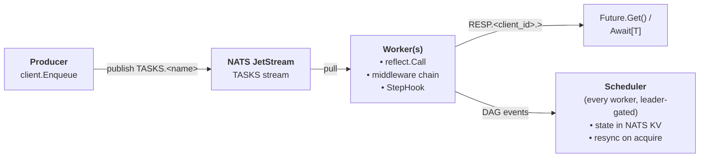

# ebind

[](https://github.com/F1bonacc1/ebind/actions/workflows/ci.yml)
[](https://github.com/F1bonacc1/ebind/actions/workflows/codeql.yml)
[](https://pkg.go.dev/github.com/f1bonacc1/ebind)
[](https://goreportcard.com/report/github.com/f1bonacc1/ebind)
[](https://github.com/F1bonacc1/ebind/releases)
[](LICENSE)

A Go task queue + DAG workflow engine built on NATS JetStream.

Function-first ergonomics (`Register(reg, MyFunc)`, `Enqueue(c, MyFunc, args...)`, `Await[T](ctx, fut)`) on top of a persistent queue with retries, dead-lettering, and optional DAG orchestration - all driven by a single NATS dependency that can run as an embedded in-process server (including 3-node HA cluster) or against an external JetStream deployment.

## Why ebind

- **NATS-native.** No Redis, no Postgres. If you already run NATS you already have ebind's dependencies.
- **Single-binary HA.** The `embed` package boots a 3-node JetStream cluster inside your process. One binary per machine, cluster.routes wired automatically.
- **Function-first API.** Pass your function reference, not a string name and a JSON schema. Reflection introspects the signature; runtime arg-type validation happens before publish.
- **Typed responses.** `Await[Profile](ctx, fut)` returns a typed value, not `interface{}`.
- **Durable DAG workflows.** Declare dependencies between steps; state lives in a NATS KV bucket so workflows survive producer restarts. Mandatory/optional steps, per-step retry policies, dynamic step addition from within handlers.

## Install

```sh
go get github.com/f1bonacc1/ebind
```

Requires Go 1.22+ and NATS JetStream 2.8+.

## Quickstart - standalone task queue

```go
package main

import (
    "context"
    "fmt"
    "log"

    "github.com/nats-io/nats.go"
    "github.com/nats-io/nats.go/jetstream"

    "github.com/f1bonacc1/ebind/client"
    "github.com/f1bonacc1/ebind/embed"
    "github.com/f1bonacc1/ebind/stream"
    "github.com/f1bonacc1/ebind/task"
    "github.com/f1bonacc1/ebind/worker"
)

// Any Go function with (context.Context, ...args) (T, error) or (context.Context, ...args) error.
func SendEmail(ctx context.Context, to, subject, body string) (string, error) {
    // ... actually send ...
    return "msg-id-42", nil
}

func main() {
    ctx := context.Background()

    // 1. Start an embedded NATS JetStream (dev). In prod, point at an external cluster
    //    or use embed.StartCluster(embed.ClusterConfig{Size: 3, ...}) for in-process HA.
    node, _ := embed.StartNode(embed.NodeConfig{Port: -1, StoreDir: "/tmp/ebind-demo"})
    defer node.Shutdown()
    nc, _ := nats.Connect(node.ClientURL())

    // 2. Create the ebind streams (TASKS, RESP, DLQ).
    js, _ := jetstream.New(nc)
    _ = stream.EnsureStreams(ctx, js, stream.Config{Replicas: 1})

    // 3. Register handlers + start worker.
    reg := task.NewRegistry()
    task.MustRegister(reg, SendEmail)

    w, _ := worker.New(nc, reg, worker.Options{Concurrency: 16})
    go w.Run(ctx)

    // 4. Enqueue from anywhere in the cluster - producer and worker can be different binaries.
    c, _ := client.New(ctx, nc, client.Options{})
    defer c.Close()

    fut, _ := client.Enqueue(c, SendEmail, "alice@example.com", "hello", "world")
    msgID, err := client.Await[string](ctx, fut)
    if err != nil {
        log.Fatal(err)
    }
    fmt.Println("sent:", msgID)
}
```

Run the bundled end-to-end demo:

```sh
make demo
```

## Quickstart - DAG workflow

```go
import (
    "github.com/f1bonacc1/ebind/task"
    "github.com/f1bonacc1/ebind/workflow"
)

// Handlers are plain functions.
func FetchUser(ctx context.Context, id string) (User, error)        { /* ... */ }
func Enrich(ctx context.Context, id string) (Enriched, error)       { /* ... */ }
func Combine(ctx context.Context, u User, e Enriched) (Profile, error)

// In main(): after EnsureStreams + worker started, wire the workflow layer.
wf, _ := workflow.NewFromNATS(ctx, nc, 1 /* replicas */)
task.MustRegister(reg, FetchUser)
task.MustRegister(reg, Enrich)
task.MustRegister(reg, Combine)

// Attach the hook + middleware so the worker talks to the workflow layer.
w, _ := worker.New(nc, reg, worker.Options{
    StepHook:   wf.Hook(),
    Middleware: []worker.Middleware{wf.ContextMiddleware()},
})
go w.Run(ctx)
go wf.RunScheduler(ctx)

// Build + submit a DAG.
dag := workflow.New()
a := dag.Step("fetch",    FetchUser, userID)
b := dag.StepOpts("enrich", Enrich, []workflow.StepOption{workflow.Optional()}, userID)
c := dag.Step("combine",  Combine, a.Ref(), b.RefOrDefault(Enriched{}))

_ = dag.Submit(ctx, wf)
profile, err := workflow.Await[Profile](ctx, wf, dag.ID(), c)
```

Key behaviors:

- `a.Ref()` - `combine` runs only if `fetch` succeeds; cascade-skips otherwise.
- `b.RefOrDefault(v)` - `combine` runs with `v` substituted if `enrich` fails or is skipped.
- `workflow.Optional()` - `enrich`'s failure does not fail the DAG.
- `workflow.WithRetry(policy)` - per-DAG default retry; `workflow.WithStepRetry(policy)` overrides per-step.
- `workflow.WithLabels("billing", "nightly")` - immutable topic tags for querying workflow history (see below).
- From inside a handler, `workflow.FromContext(ctx).Step(...)` adds more steps dynamically.
- `workflow.Pause` / `workflow.Resume` - graceful whole-DAG pause: in-flight steps drain, pending steps are fenced.
- `workflow.BreakBefore("label")` / `workflow.BreakAfter("label")` - per-step breakpoints (see below).

### Step breakpoints

Stop a DAG line at a specific step to inspect intermediate state, then continue - debugger semantics for workflows:

```go
// Breakpoint labels are part of the DAG's structure...
dag := workflow.New()
parse  := dag.Step("parse", Parse, download.Ref())
upload := dag.StepOpts("upload", Upload,
    []workflow.StepOption{workflow.BreakBefore("BeforeUpload")}, parse.Ref())

// ...but which ones are ARMED is decided when you run it.
_ = dag.Submit(ctx, wf, workflow.WithActiveBreakpoints("BeforeUpload"))

// The line stops with `upload` pending (never dispatched); parallel branches keep running.
// Inspect whatever you need, then continue:
n, _ := workflow.ResumeBreakpoint(ctx, wf, dag.ID(), "BeforeUpload")
```

- `BreakBefore(labels...)` stops before the step executes (it stays `pending`); `BreakAfter(labels...)` lets the step complete - result persisted - but holds its direct dependents.
- Breakpoints are **inactive by default**. `WithActiveBreakpoints(labels...)` is a `Submit` option, so a statically defined DAG decides at run time which breakpoints to arm; a breakpoint with several labels is armed (and resumable) by any one of them.
- `ResumeBreakpoint` is "continue", not "disable": the label stays armed, so a later step (including dynamically added ones) carrying it stops again.
- Blocked state lives in NATS KV - it survives restarts, and any process (or `ebctl`) can list and resume:

```sh
ebctl dag bp ls <dag-id>              # STEP | POS | LABELS | ARMED | STATE | SINCE | HOLDING
ebctl dag bp resume <dag-id> <label>  # release the blocked line(s); label stays armed
ebctl dag watch                       # live feed includes bp_hit / bp_resumed events
```

See [`examples/15-workflow-breakpoints`](./examples/15-workflow-breakpoints) for a runnable two-stop walkthrough.

### Resuming `Await` from another instance

DAG state + step results live in NATS KV. Workers keep running independently of whoever called `Await`. If the waiting process dies, the DAG continues; results land in KV and stay there. A different process (same NATS cluster) can resume the wait with only the DAG and step IDs:

```go
// Instance A - submitter. Persist these two strings somewhere (DB, Redis, file).
dagID  := dag.ID()
stepID := c.ID()            // the *Step you'd pass to Await
_ = dag.Submit(ctx, wf)
// ... instance A may exit now ...

// Instance B - resumer. No *Step handle needed.
wfB, _  := workflow.NewFromNATS(ctx, nc, 1)
result, err := workflow.AwaitByID[Profile](ctx, wfB, dagID, stepID)
```

`AwaitByID` uses NATS KV `IncludeHistory()` under the hood, so late subscribers still receive results that were written before they started watching. See [`examples/11-workflow-resume`](./examples/11-workflow-resume) for a runnable two-invocation demo.

### Labeling & querying workflow history

Attach immutable string tags at creation to group workflows by topic, then retrieve only the relevant ones from the history:

```go
// Labels are fixed at New and persisted at Submit - immutable for the DAG's lifetime.
dag := workflow.New(workflow.WithLabels("billing", "nightly"))
// ... add steps ...
_ = dag.Submit(ctx, wf)

// Query the history by label (AND semantics: a DAG must carry all given labels),
// newest-first. No labels returns every DAG.
billing, _ := workflow.ListDAGsByLabels(ctx, wf, "billing")            // every "billing" workflow
both, _    := workflow.ListDAGsByLabels(ctx, wf, "billing", "nightly") // only those carrying both
```

- Labels are plain string tags - a workflow carries a set of them; a label is shared across many workflows.
- `ListDAGsByLabels` is a client-side filter over the full DAG history (the same scan `ebctl dag ls` performs), so it needs no secondary index and survives in NATS KV for the DAG's lifetime.
- `ebctl` exposes the same query and surfaces labels in listings:

```sh
ebctl dag ls --label billing               # only workflows tagged "billing"
ebctl dag ls --label billing --label nightly   # AND: carry both labels
ebctl dag ls                               # LABELS column shown for every DAG
ebctl dag get <dag-id>                      # includes a `labels:` line
```

See [`examples/16-workflow-labels`](./examples/16-workflow-labels) for a runnable submit-then-query walkthrough.

## Inspecting failures

When a task or DAG step fails terminally (retries exhausted or a non-retryable error), ebind records the failure in three places:

- **The DAG step record** (NATS KV, lives for the DAG's lifetime): the step status flips to `failed` and the record stores both `error_kind` (a category — e.g. `handler`, `deadline`, `panic`) and `error_msg` (the handler's error text). This is written by the same hook that fails the step, so it's available as soon as the step shows `failed` — no DLQ round-trip needed.
- **The DLQ** (`EBIND_DLQ` stream, default 7-day retention): the full `dlq.Entry` with the complete `TaskError`, attempt count, and timestamp.
- **The response stream** (`EBIND_RESP`, short retention): the `TaskError` surfaces through `Await` / `Future.Get` as a Go error.

Inspect either with the `ebctl` operator CLI:

```sh
# DAG step — durable error kind + message straight from the step record
ebctl dag get <dag-id>                 # every step: status + error kind
ebctl dag step get <dag-id> <step-id>  # one step: error_kind + error_msg

# DLQ — terminally failed tasks with the full error message
ebctl dlq ls                           # table: SEQ, FN, ERROR, ATTEMPT, AGE
ebctl dlq show <seq>                   # full entry incl. error_message + payload
```

The error text persisted into the step record is bounded by `Workflow.MaxStepErrorBytes` (default 4096; set negative to keep only the error kind — useful when error text may contain sensitive data). The full, untruncated message is always available in the DLQ entry. Note that only *terminal* failures are recorded; an attempt that will still be retried writes nothing to the step record — use the `worker.Log` middleware to capture per-attempt errors.

## Architecture



- **`task.Registry`** - name → reflect.Value map; `Register(fn)` introspects signature.
- **`client.Client`** - one response-consumer per client; routes responses to typed Futures.
- **`worker.Worker`** - pull consumer + middleware chain (`Recover`, `Log`, user) + per-task retry policy.
- **`embed.StartCluster(3)`** - in-process 3-node JetStream cluster with loopback routes.
- **`workflow`** - DAG builder + persistent state (KV bucket `ebind-dags`) + event-driven scheduler with leader-elector-gated sweep for stranded recovery.

See [CLAUDE.md](./CLAUDE.md) for the full architectural walk-through.

## Production concerns

| Concern | Handled by |
|---|---|
| At-least-once delivery | JetStream `AckExplicitPolicy` + `MaxDeliver` |
| Exactly-one enqueue on retries | JetStream `Nats-Msg-Id` dedupe with 5-min window |
| State consistency | NATS KV `Update(key, val, expectedRev)` CAS |
| Handler panics | `worker.Recover` middleware → `TaskError{Kind: "panic"}` |
| Retry control | `task.RetryPolicy` on envelope (per-task) or `worker.Options.MaxDeliver` default |
| Non-retryable errors | `RetryPolicy.NonRetryableErrorKinds` OR `TaskError{Retryable: false}` |
| Dead-lettering | `dlq.Publish` auto-called on final failure → `EBIND_DLQ` stream |
| Failure visibility | Failed step record carries `error_kind` + `error_msg` (durable in KV, via `ebctl dag step get`); full `TaskError` in `EBIND_DLQ`; cap with `Workflow.MaxStepErrorBytes` |
| Graceful shutdown | `worker.Run(ctx)` drains in-flight on ctx-cancel (configurable grace) |
| HA | 3-node embedded cluster with `Replicas: 3` streams & KV |
| Stranded DAG recovery | `Scheduler` sweep on `LeaderElector` false→true edge |

## Package layout

```
task/         envelope + registry + RetryPolicy
client/       Enqueue + Future + Await[T]
worker/       consume loop + middleware + StepHook
stream/       JetStream stream setup
dlq/          dead-letter publishing
embed/        in-process NATS server (single + cluster)
workflow/     DAG builder + scheduler + KV-backed state
internal/testutil/  harness for integration tests
cmd/demo/     single-process end-to-end demo
cmd/ebctl/    operator CLI: inspect DAGs/steps/results, DLQ, streams
```

## Development

```sh
make help          # list all targets
make build         # compile everything
make test          # run all tests with -race
make test-count    # 3× runs, catch flakes
make lint          # golangci-lint
make cover         # HTML coverage report
make demo          # run cmd/demo end-to-end
```

## Status

- v1 (task queue): done - retries, DLQ, middleware, embedded HA cluster.
- v2 (DAG workflows): done - optional steps, retry policies, dynamic DAGs.
- v2.1 (stranded recovery): done - leader-acquisition sweep.
- v2+ (future): phantom-Running detection, cross-DAG signals, saga/compensation.

## License

MIT
